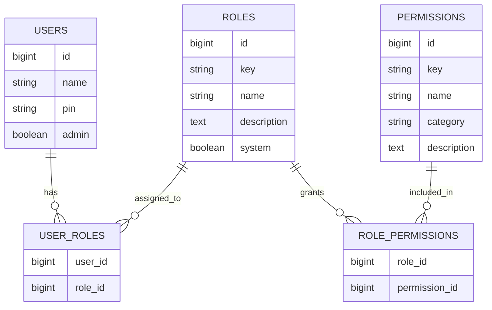
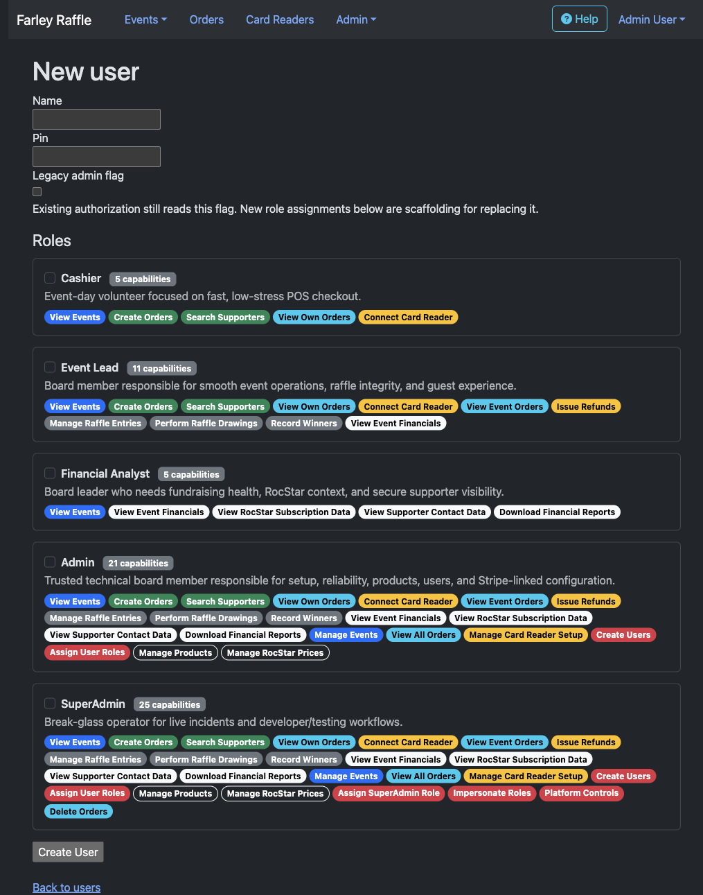

# RBAC Scaffold

The app uses database-backed role-based access control for internal operator
authorization. The legacy `users.admin` Boolean remains only as migration source
data for assigning existing admins to `platform_admin`.

For the product reasoning behind these roles, see [Personas](personas.md).

## Implementation Status

Current state:

- Roles and permissions are persisted in the database.
- Users can have many roles.
- Roles can have many permissions.
- Existing `users.admin = true` users are backfilled into `platform_admin`
  (`SuperAdmin` in the UI).
- User management can assign roles.
- Controller and view authorization checks read RBAC permissions.
- Navigation and action links are filtered by the same permission helpers.

Not implemented yet:

- Impersonation.
- Audit logging.
- Export controls.
- Per-event scoping.

The compatibility goal is to preserve the legacy admin backfill path while new
checks use permissions directly.

## Data Model

## Role Catalog

Roles are shown from least to most powerful in user management. The UI renders
human-readable capability badges instead of raw permission keys. Higher-power
roles do not hide behind "all of the above"; they show the repeated badges so
overlap and blast radius are visible at a glance.

The database still stores flat role-permission assignments. There is no role
inheritance in v1.

### `cashier`

Persona: Cashier / Sales Volunteer

Purpose: operate point-of-sale during an event without access to configuration,
global reporting, or user management.

Permissions:

- `events.view`
- `pos.sell`
- `customers.search`
- `orders.view_own`
- `card_readers.connect`

Capability badges:

`View Events` `Create Orders` `Search Supporters` `View Own Orders`
`Connect Card Reader`

### `event_lead`

Persona: Event Lead / Board Member

Purpose: manage live event operations, raffle integrity, winner handling, and
event-level fundraising context.

Permissions:

- `events.view`
- `pos.sell`
- `customers.search`
- `orders.view_own`
- `card_readers.connect`
- `orders.view_event`
- `refunds.issue`
- `entries.manage`
- `drawings.manage`
- `winners.manage`
- `reports.view_fundraising`

Capability badges:

`View Events` `Create Orders` `Search Supporters` `View Own Orders`
`Connect Card Reader` `View Event Orders` `Issue Refunds`
`Manage Raffle Entries` `Perform Raffle Drawings` `Record Winners`
`View Event Financials`

### `board_reporter`

UI name: Financial Analyst

Persona: Board Reporter / Financial Analyst

Purpose: view fundraising health, payment split, RocStar context, and supporter
PII when board work requires it.

Permissions:

- `events.view`
- `reports.view_fundraising`
- `subscriptions.view`
- `reports.view_pii`
- `reports.download`

Capability badges:

`View Events` `View Event Financials` `View RocStar Subscription Data`
`View Supporter Contact Data` `Download Financial Reports`

### `config_admin`

UI name: Admin

Persona: Config Admin

Purpose: prepare the system for events, manage trusted setup, assign users, and
support Stripe-linked configuration without platform-only break-glass powers.

Permissions:

- `events.view`
- `pos.sell`
- `customers.search`
- `orders.view_own`
- `card_readers.connect`
- `orders.view_event`
- `refunds.issue`
- `entries.manage`
- `drawings.manage`
- `winners.manage`
- `reports.view_fundraising`
- `subscriptions.view`
- `reports.view_pii`
- `reports.download`
- `events.manage`
- `orders.view_all`
- `card_readers.manage`
- `users.manage`
- `roles.assign`
- `pos_products.manage`
- `roc_star_prices.manage`

Capability badges:

All Cashier, Event Lead, and Financial Analyst capabilities, plus:
`Manage Events` `View All Orders` `Manage Card Reader Setup` `Create Users`
`Assign User Roles` `Manage Products` `Manage RocStar Prices`

### `platform_admin`

UI name: SuperAdmin

Persona: Platform Admin

Purpose: break-glass support, testing, incident recovery, and eventual
impersonation.

Permissions:

- All permissions in the scaffold.

Capability badges:

All Admin capabilities, plus:
`Assign SuperAdmin Role` `Impersonate Roles` `Platform Controls` `Delete Orders`

## Permission Catalog

| Key | Category | Intended meaning |
| --- | --- | --- |
| `events.view` | events | View event lists, dashboards, and operational context. |
| `events.manage` | events | Create and edit event records. |
| `entries.manage` | raffle | Create, edit, import, and delete raffle entries. |
| `drawings.manage` | raffle | Create drawings and inspect drawing output. |
| `winners.manage` | raffle | Find winners and update claim status. |
| `pos.sell` | point_of_sale | Use the point-of-sale workflow to create orders. |
| `customers.search` | point_of_sale | Search customer records during checkout. |
| `orders.view_own` | orders | View orders created by the current user. |
| `orders.view_event` | orders | View orders for an active event. |
| `orders.view_all` | orders | View all orders across events. |
| `orders.delete` | orders | Delete order records when recovery requires it. |
| `refunds.issue` | payments | Issue refunds for paid orders. |
| `card_readers.connect` | payments | Connect or select a Stripe Terminal reader during checkout. |
| `card_readers.manage` | payments | Assign Stripe Terminal readers and manage reader setup. |
| `users.manage` | admin | Create and edit users and PINs. |
| `roles.assign` | admin | Assign RBAC roles to users. |
| `super_admin.assign` | admin | Assign the highest-power platform role. |
| `pos_products.manage` | configuration | Create, edit, activate, and reorder POS products. |
| `roc_star_prices.manage` | configuration | Manage recurring subscription price records. |
| `reports.view_fundraising` | reporting | View fundraising totals, MRR, and payment-method breakdowns. |
| `reports.view_pii` | reporting | View supporter contact details in reporting surfaces. |
| `reports.download` | reporting | Download financial report exports. |
| `subscriptions.view` | reporting | View RocStar supporter/subscription context. |
| `platform.impersonate` | platform | Use role impersonation for testing and support. |
| `platform.break_glass` | platform | Use platform-level rescue controls during live incidents. |

## Public And Non-RBAC Surfaces

Buyer, donor, and RocStar flows are not internal RBAC roles in v1. Public or
assisted checkout surfaces should remain available through purpose-built routes
and Stripe flows, not through assigning a "buyer" role to a user record.

The same person may be both a donor and an internal operator. In that case, only
their operator access belongs in RBAC.

## Migration Plan

1. Land this scaffold with no behavior change to controller checks. Done.
2. Keep `users.admin` as the compatibility flag while role assignments are added. Done.
3. Backfill every legacy admin user into `platform_admin` / SuperAdmin. Done.
4. Add policy/helper methods that check permissions. Done.
5. Replace each `current_user_is_admin?` or `require_admin!` usage with the
   narrow permission needed by that route. Done.
6. Hide navigation based on the same permissions. Done.
7. Add role impersonation for platform admins so each persona can be reviewed in
   browser testing.
8. Remove or freeze direct use of `users.admin` after all checks move to RBAC.

## Authorization Guidance

Future checks should name permissions, not roles. Roles are bundles assigned to
people; permissions are the stable capabilities code should ask about.

Examples:

- POS routes should check `pos.sell`.
- User management should check `users.manage` and `roles.assign`.
- Reports can allow aggregate access with `reports.view_fundraising` while
  hiding contact details unless `reports.view_pii` is present.
- Platform incident tooling should check `platform.break_glass`.

## UX Review Checklist

When reviewing the app through Browser Control, exercise each assignable role:

- Cashier: can complete common POS tasks quickly, cannot see configuration.
- Event Lead: can create orders, issue refunds, manage raffle operations, and
  inspect event order context.
- Financial Analyst: can understand reports and supporter context without edit
  controls.
- Admin: can set up products, users, readers, events, and RocStar prices.
- SuperAdmin: can access support-only controls and impersonate other roles
  once that feature exists.

During each pass, note:

- Navigation that appears but should be hidden.
- Actions that are allowed but should be disabled.
- Copy that uses internal language instead of persona language.
- Workflows where recovery depends on technical knowledge.
- Screens that expose PINs or PII more broadly than the role requires.
